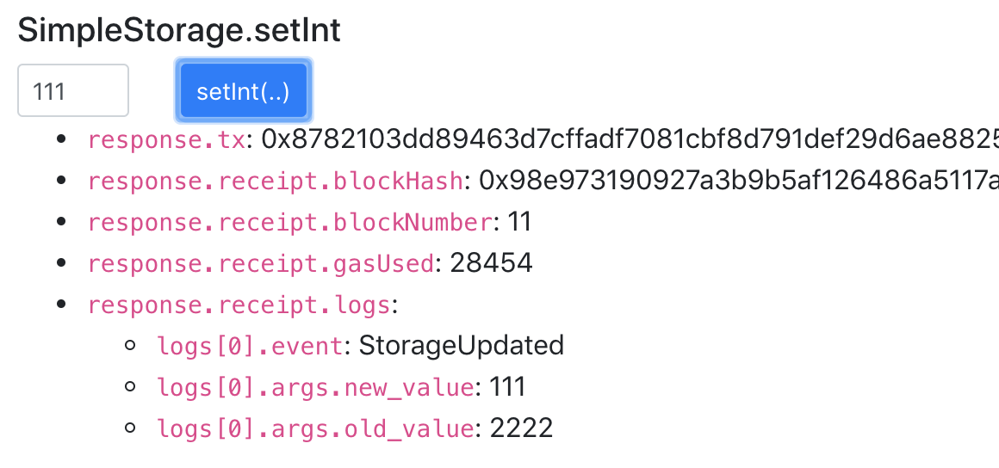
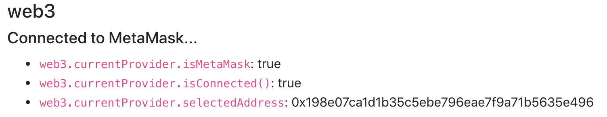
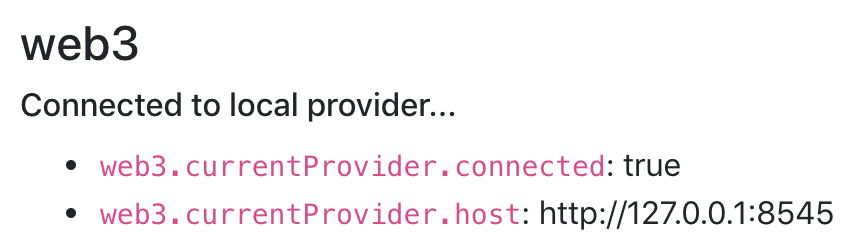

# React+Data Starter Truffle Box

This ready-to-hack box extends on the basic react-box by adding:
* A lower level view on the data structures truffle uses under the hood
* Showing events emitted from a contract call.
* Simple get/set UI components for interacting with a contract.
* Debug logs and helpful messaging for when things don't go right.
* A walking tour of the DApp showing some of the interactions between the browser, MetaMask, Ganache and the contract.


## Installation

In terminal #1:
```
$ npm install -g truffle
$ mkdir react-data-starter-box
$ cd react-data-starter-box
$ truffle unbox git@github.com:decentraldynamics/react-data-starter-box
$ npm install
```

Start up the [Ganache UI](https://truffleframework.com/ganache) listening on port 8545 (UI: Settings -> Port Number). OR you can use the cli version (run in its own terminal window):
```
$ npm install -g ganache-cli
$ ganache-cli -p 8545
```

```
$ truffle compile
$ truffle test
$ truffle migrate
```
Note: Disable MetaMask if you already have it installed in your browser (Chrome -> Window -> Extensions). We'll enable it later but let's start off simple and connect to Ganache directly for now.

In terminal #2:
```
$ cd react-data-starter-box/client
$ npm install
$ npm start
```

Connect to http://localhost:3000 and you should see something like:


## Things to try next

### setInt() and getInt()

Click the `getInt()` button and you should get a `0` back. This is because the `SimpleStorage` contract does not define an initial value for `stored_uint` so we get back a `0`.

Try the `setInt` button with an integer:



The response from truffle includes the transaction's hash (`tx`), some info on the block that the tx was captured in and the `logs` from the transactions. Those `logs` are the list of events emitted by the contract call. `setInt()` emits an event called `StorageUpdated` with `new_value` and `old_value`.

This simple contract only handles `uint` values so giving it anything else e.g. `foo` or `3.14`  will fail.

`Error: invalid number value (arg="number", coderType="uint256", value="3.4")`

Try a negative number e.g `-2` then `setInt()` will work fine without any errors but things will be messed up behind the scenes since the contract is only prepared to handle unsigned ints (`uint`). Click `getInt` and you will get:

`Error: Number can only safely store up to 53 bits`

Advice: Be very careful doing any math in Solidity contracts. Start each function with lots of `require()` checks to block bad data as soon as possible.

Setting things back to a valid int will fix the contract state.

### Shutdown Ganache

Ctrl-C or exit Ganache and hit http://localhost:3000 again. The DApp doesnt have anything to connect to so you get an alert like: 

`Something went wrong loading accounts from [http://127.0.0.1:8545]: Error: Invalid JSON RPC response: ""`. 

Start up Ganache and try again. This time you should get an alert like: 

`Something went wrong loading the contract: Error: SimpleStorage has not been deployed to detected network (network/artifact mismatch)`

Ganache starts off with a clean DB everytime so anything you deployed earlier with 'truffle migrate' is forgotten.

Deploy the contracts again: `$ truffle migrate` and reload.


### Enable/Disable MetaMask

`utils/getWeb3.js` does its best to create a web3 instance connected to any provider it can find. It checks (in order):
  1. Something built into the browser
  2. A browser extension like MetaMask
  3. Something local running on port 8545

On Chrome, you can go to Window -> Extensions and easily enable/disable the extension with dealing without any re-installation.

With MetaMask enabled:


Without it:



## TODO

### Possible Errors
* 'Something went wrong loading the contract: TypeError: Cannot read property 'gasLimit' of null'
* 