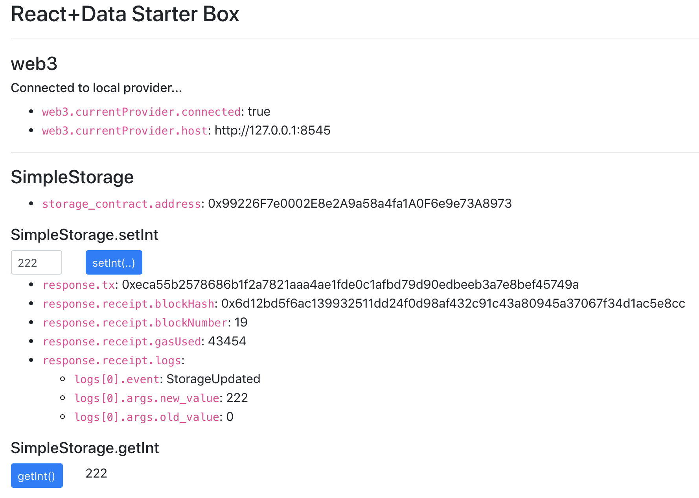

# React Truffle Starter Box

This box is extends on the barebones react-box truffle by adding:
* A lower level view in the data structures truffle uses under the hood
* Detecting events emitted from a contract call.
* Simple get/set UI components for interacting with a contract.
* Debug logs and helpful messaging for when things don't go right.

## Installation


In terminal #1:
```
$ git clone ....
$ cd react-data-starter-box/
$ npm install -g truffle
$ npm install
$ truffle compile
$ truffle test
$ truffle migrate
```

Start up the [Ganache UI](https://truffleframework.com/ganache) listening on port 8545 (UI: Settings -> Port Number). OR you can use the cli version (run in its own terminal window):
```
$ npm install -g ganache-cli
$ ganache-cli -p 8545
```


In terminal #2:
```
$ cd react-data-starter-box/client
$ npm install
$ npm start
```
Connect to http://localhost:3000 an you should see something like:




## Things to try next

### Enable & Disable the MetaMask extension

`utils/getWeb3.js` does its best to create a web3 instance connect to any provider it can find.. It check (in order):
    * Something built into the browser
    * A browser extension like MetaMask
    * Something local running on port 8545

### Shutdown ganache and try connecting again

Ctrl-C or exit Ganache and hit http://localhost:3000 again. You get an alert like: `Something went wrong loading accounts from [http://127.0.0.1:8545]: Error: Invalid JSON RPC response: ""`. Thats because our web app doesnt have an ethereum client to connect

You get an alert like: `Something went wrong loading the contract: Error: SimpleStorage has not been deployed to detected network (network/artifact mismatch)`
